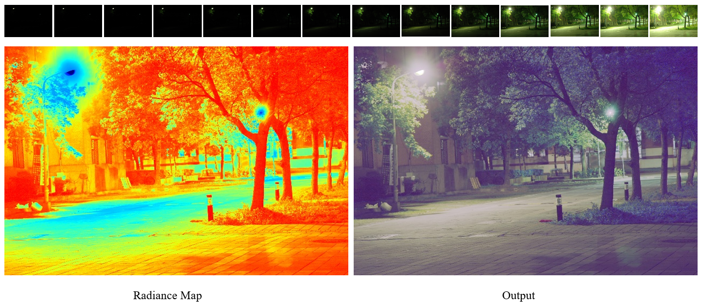

# Deep HDR Imaging
The Keras Implementation of the [Recovering High Dynamic Range Radiance Maps from Photographs](https://people.eecs.berkeley.edu/~malik/papers/debevec-malik97.pdf) - SIGGRAPH 97
## Content
- [HDRI](#hdr-imaging)
- [Getting Started](#getting-tarted)
- [Running](#running)
- [References](#references)
- [Citations](#citation)

## Getting Started

- Clone the repository

### Prerequisites
- PIL
- numpy
- opencv

```python
pip install -r requirements.txt
```

## Running
    ```
    python main.py --tonemap 'gamma' --cmap True
    ```
## Usage
### Training
```
usage: main.py [-h] [--test_path] 
                    [--tonemap] 
                    [--cmap]
```

```
optional arguments: -h, --help  show this help message and exit
                    --test_path path to test images
                    --tonemap   choose tonemap method
                    --cmap      save radiance map
```

#### Result
 

## License

This project is licensed under the MIT License - see the [LICENSE](https://github.com/tuvovan/NHDRRNet/blob/master/LICENSE) file for details

## References
[1] Recovering High Dynamic Range Radiance Maps from Photographs [link](https://people.eecs.berkeley.edu/~malik/papers/debevec-malik97.pdf) - SIGGRAPH 97

[3] Test data - [link](google.com)

## Citation
```
    @inproceedings{10.1145/258734.258884,
                    author = {Debevec, Paul E. and Malik, Jitendra},
                    title = {Recovering High Dynamic Range Radiance Maps from Photographs},
                    year = {1997},
                    isbn = {0897918967},
                    publisher = {ACM Press/Addison-Wesley Publishing Co.},
                    address = {USA},
                    url = {https://doi.org/10.1145/258734.258884},
                    doi = {10.1145/258734.258884},
                    booktitle = {Proceedings of the 24th Annual Conference on Computer Graphics and Interactive Techniques},
                    pages = {369–378},
                    numpages = {10},
                    series = {SIGGRAPH '97}
    }
```
## Acknowledgments
- Any ideas on updating or misunderstanding, please send me an email: <vovantu.hust@gmail.com>
- If you find this repo helpful, kindly give me a star.